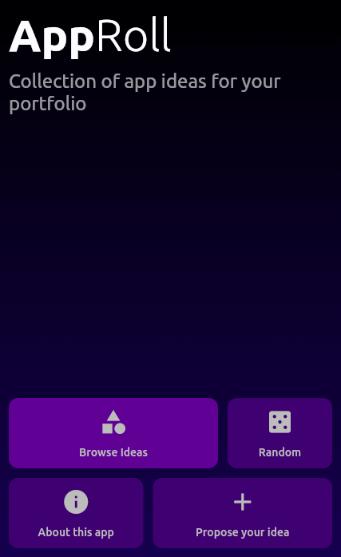

 

# AppRoll

Collection of app ideas for your programming portfolio

---

    

---

## Table of Contents

- [Installation](#installation)
- [Screenshots](#screenshots)
- [Contributing](#contributing)
- [License](#license)

---

## Installation

**Option 1**
- If you're familiar with Flutter, just grab the source code and play with the app.

**Option 2**
- If you have an Android device, [download the app](https://play.google.com/store/apps/details?id=org.mivoligo.app_ideas) from the Play Store.

---

## Screenshots:

  

 

---

## Contributing
- Feel free to report issues or propose improvements.

---

## License

- **[MIT license](http://opensource.org/licenses/mit-license.php)**
- Copyright (c) Michał Prędotka
